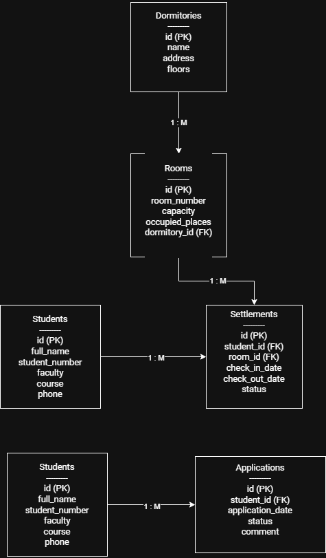

# 15. Load Assignment Service (Сервис распределения нагрузки):
- # Название таблицы
|---|---|---|
|поле | тип | доп. параметры|
|поле | тип | доп. параметры|

- # LoadAssignment
|---|---|---|
|id | Integer | PK|
|teacher_id | Integer | FK -> Teacher.id|
|discipline_id | Integer | FK -> Discipline.id|
|group_id | Integer | FK -> Group.id|
|semester | Integer | 1-8|
|load_hours | Decimal(5,2) | >0 |

  
- # Teacher
|---|---|---|
|id | Integer | PK|
|full_name | Varchar(200) | NOT NULL, UNIQUE|
|position | Varchar(100) | NOT NULL|

# Discipline
|---|---|---|
|id | Integer | PK|
|name | Varchar(200) | NOT NULL, UNIQUE|
|hours_total | Integer | NOT NULL |

# Group
|---|---|---|
|id | Integer | PK|
|group_number | Varchar(20) | NOT NULL, UNIQUE|
|specialty_id | Integer | NOT NULL|

- # Students
| Поле | Тип | Ограничения |
|---|---|---|
| id | Integer | PK |
| student_number | Varchar | UNIQUE |
| current_group_id | Integer | FK |
| status | Varchar | NOT NULL |

### ER-диаграмма

